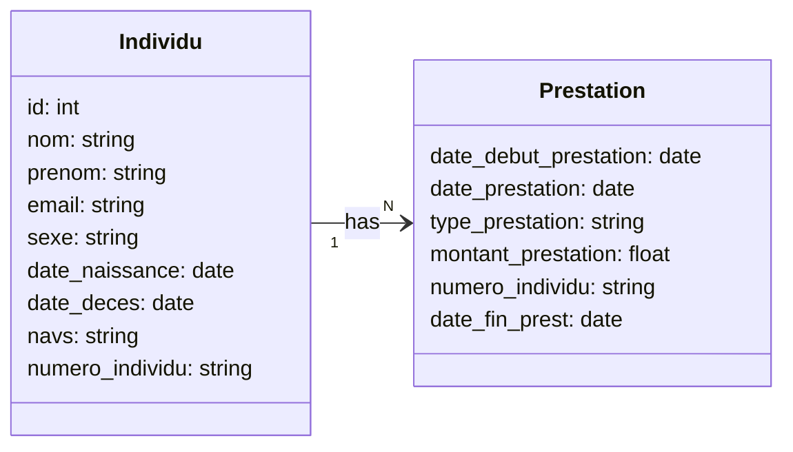

# m_fabric
## Jeu de données:




La table `PrestationIndividu`

```sql
CREATE TABLE atelier01.PrestationIndividu
(
id INT,
nom VARCHAR(100),
prenom VARCHAR(100),
email VARCHAR(255),
sexe CHAR(1),
date_naissance DATE,
date_deces DATE,
navs VARCHAR(50),
numero_individu VARCHAR(50),
date_debut_prestation DATE,
date_prestation DATE,
type_prestation VARCHAR(100),
montant_prestation DECIMAL(18,2),
date_fin_prestation DATE
)
GO
```


---

```
+-----------------+       1        N       +---------------------+
|    Individu     |<--------------------->|      Prestation      |
+-----------------+                       +---------------------+
| - id            |                       | - date_debut_prest   |
| - nom           |                       | - date_prestation    |
| - prenom        |                       | - type_prestation    |
| - email         |                       | - montant_prestation |
| - sexe          |                       | - numero_individu    |
| - date_naissance|                       | - date_fin_prest     |
| - date_deces    |                       +---------------------+
| - navs          |
| - numero_individu|
+-----------------+
```
